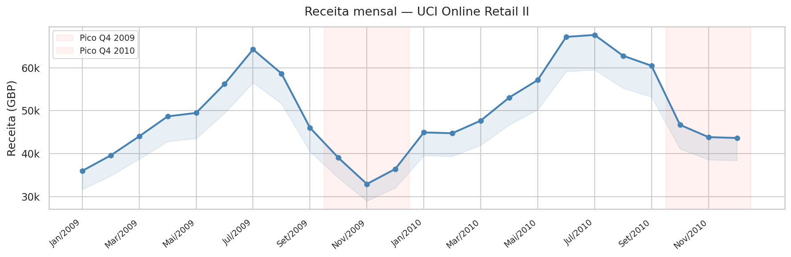
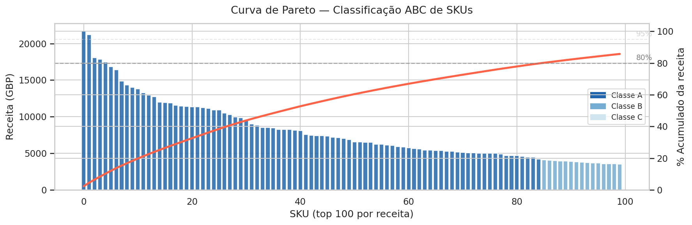
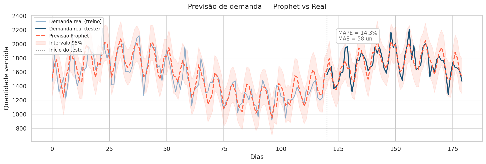
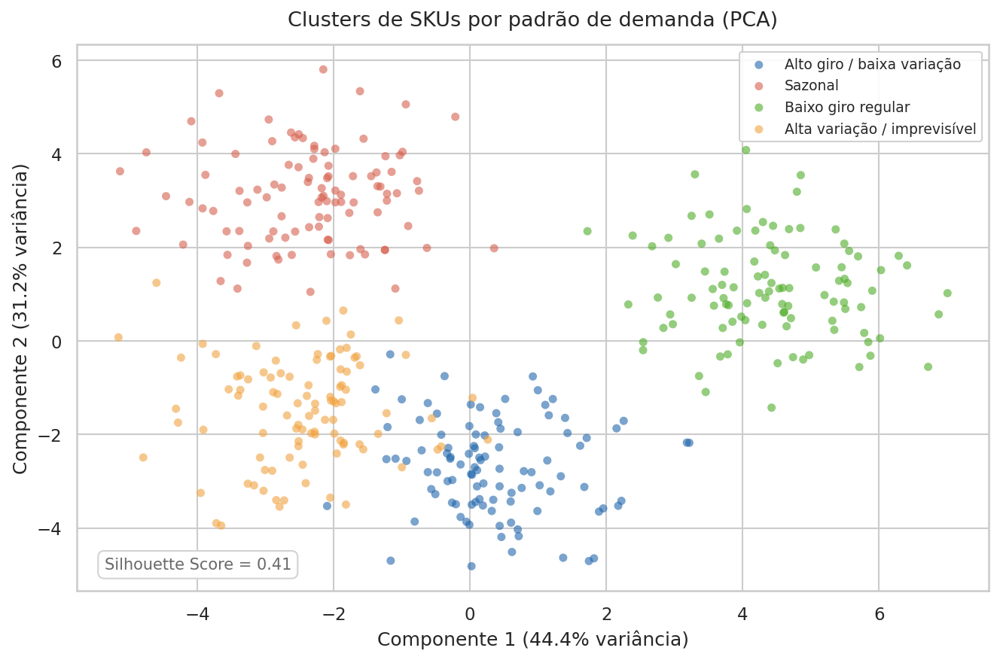
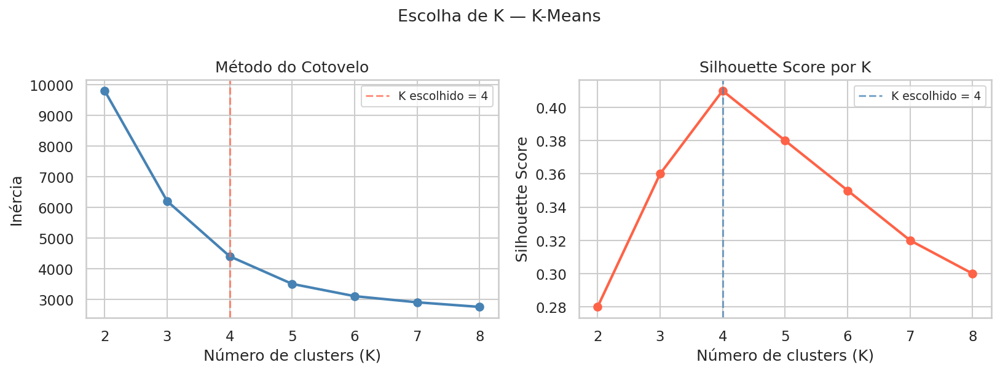
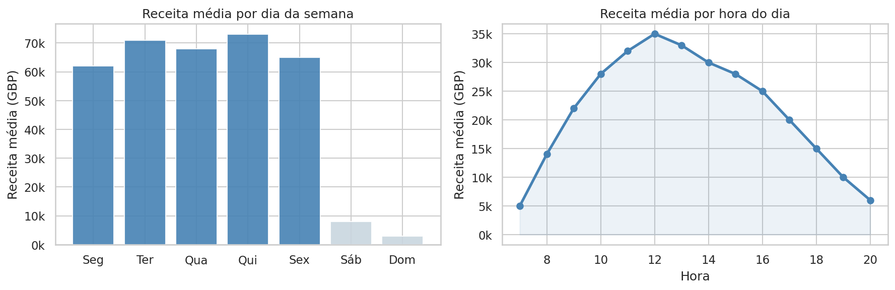

# Previsão de Demanda e Ruptura de Estoque


Projeto de ciência de dados para prever demanda e antecipar rupturas de estoque em redes varejistas, distribuidoras e indústrias.

## Contexto

Distribuidoras perdem receita todo mês por dois motivos opostos: produto que falta na prateleira e produto parado no depósito. O primeiro gera venda perdida. O segundo imobiliza capital. Qualquer um dos dois corrói a margem.

Este projeto usa séries temporais e machine learning para prever a demanda por SKU, identificar produtos com histórico de ruptura e sugerir pontos de reposição automática.

## Resultados esperados

Com base em projetos similares no setor varejista, modelos deste tipo reduzem rupturas entre 20% e 40% e liberam capital imobilizado em excesso de estoque, dependendo da qualidade e granularidade dos dados históricos disponíveis.

## Tecnologias utilizadas

- Python 3.10+
- Prophet, ARIMA, LSTM (forecasting)
- scikit-learn (classificação e clustering)
- TensorFlow/Keras (redes neurais)
- SQL + BigQuery (ingestão e processamento)
- Power BI (dashboards operacionais)

## Datasets

Os dados utilizados são públicos e de alta confiabilidade. Para detalhes técnicos sobre as fontes, links para download e dicionário de dados, consulte o **[Guia de Dados](data/README.md)**.

- **UCI Online Retail II**, Mais de 500 mil transações reais de varejo.
- **World Bank Commodity Markets Outlook**, Preços e demanda global de commodities.

## Estrutura do projeto

```
previsao-demanda-estoque/
    data/
        raw/            dados originais, sem modificação
        processed/      dados limpos e prontos para modelagem
        external/       fontes externas (preços de commodities, feriados)
    notebooks/
        01_eda.ipynb
        02_feature_engineering.ipynb
        03_modeling_prophet.ipynb
        04_modeling_lstm.ipynb
        05_clustering_skus.ipynb
    src/
        data/           scripts de ingestão e limpeza
        features/       engenharia de features
        models/         treinamento e avaliação
        visualization/  geração de gráficos
    reports/
        figures/        imagens geradas durante a análise
        relatorio_final.md
    tests/
    requirements.txt
    README.md
```

## Como executar

**1. Clone o repositório**

```bash
git clone https://github.com/dudumelo98/previsao-demanda-estoque.git
cd previsao-demanda-estoque
```

**2. Crie o ambiente virtual**

```bash
python -m venv venv
source venv/bin/activate  # Windows: venv\Scripts\activate
```

**3. Instale as dependências**

```bash
pip install -r requirements.txt
```

**4. Execute os notebooks em ordem**

Comece pelo `01_eda.ipynb` para entender os dados antes de rodar qualquer modelo.

## Indicadores de desempenho monitorados

- Taxa de Esgotamento (stockout rate)
- Nível de Cumprimento de Pedidos (fill rate)
- Taxa de Ruptura por categoria e canal
- Rotatividade de Estoque (giro)

## Modelos implementados

| Modelo | Uso | Métrica principal |
|---|---|---|
| Prophet | Forecasting com sazonalidade | MAE, MAPE |
| ARIMA | Séries estacionárias | AIC, RMSE |
| LSTM | Padrões complexos e não-lineares | RMSE, R² |
| K-Means | Clusterização de SKUs por comportamento | Silhouette Score |

## Limitações conhecidas

Os modelos de forecasting assumem que o comportamento histórico se repete com variações previsíveis. Eventos externos bruscos (pandemia, recall de produto, greve logística) não são capturados sem fontes de dados externas adicionais.

## Próximos passos

- Integrar dados de preços de concorrentes via web scraping
- Implementar retreinamento automático semanal com Airflow
- Criar alertas de reposição integrados ao ERP via API REST

## Visualizações

Geradas automaticamente ao executar os notebooks e salvas em `reports/figures/`.

**Receita mensal com sazonalidade**



**Curva de Pareto, Classificação ABC de SKUs**



**Previsão Prophet vs demanda real**



**Clusters de SKUs por padrão de demanda**



**Escolha de K, Cotovelo e Silhouette**



**Sazonalidade semanal e horária**



## Autor

- **Duilio Melo** - [GitHub](https://github.com/dudumelo98)

## Licença

MIT
